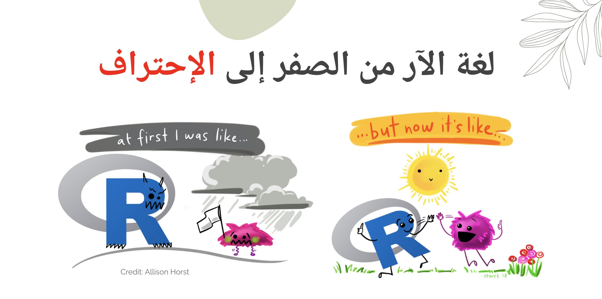
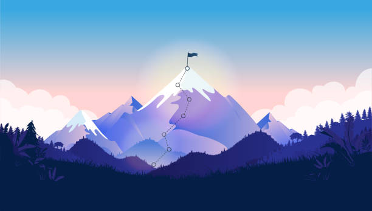

[***R.journey From Zero To Hero***]{.underline}

{width="334"}

*There are very few (if any) fields today that aren't impacted in some way, shape or form by programming. Programming is a term that's basically synonymous with technology and what professional field today doesn't employ some form of technology? The ability to code has become one of those skills that open up an incredible number of doors if you possess it and it's this fact that led me to venture into the world of R-- one of many programming languages-- to simply explore it and see what I could learn. I wanted to write this article not to convince people to pick up coding as a skill (although it's great) but more as a documentation of my journey in learning a new skill and how important having an actual purpose for something like this can be, however small or niche.*

*I officially started this journey just over a year ago and it's important to note that I didn't really start it with any specific goal in mind nor did I have any real notion of where I could apply this skill. In short, I had no purpose. Now, this wasn't a problem initially because I guess you could say my purpose was just to learn the language but even that in itself is incredibly vague and doesn't provide a clear enough end point.*

In 2022 I found the best course "from-Zero-to-hero-in-r" By [Jeelaidm](https://www.jeelaidm.com/login?state=eyJuYW1lIjoiVmlld0NvdXJzZUNvbnRlbnQiLCJmdWxsUGF0aCI6Ii9jb3Vyc2Uvdmlldy1jb250ZW50LzYyODRiMzVmNjg2N2YxMTUyMzJhODgwYyIsInBhdGgiOiIvY291cnNlL3ZpZXctY29udGVudC82Mjg0YjM1ZjY4NjdmMTE1MjMyYTg4MGMiLCJxdWVyeSI6e30sInBhcmFtcyI6eyJpZCI6IjYyODRiMzVmNjg2N2YxMTUyMzJhODgwYyJ9fQ%3D%3D)

This is a course designed by Batool Almarzouq and delivered in JeelAIDM

-   **Week1**: Introduction to R and RStudio

-   **Week2**: Introduction to Git/GitHub

-   **Week3**: First steps in the `tidyverse`

-   Week4: Introduction to ggplot2

-   Week5: Publishing R Markdown and Creating a blog with R Markdown

-   Learn How to Join with R Communities (R-Ladies, Open Science Community Saudi Arabia, R-Ladies Saudi Arabia (Dammam)



It has been a long journey but it made my summer much more interesting. 💕

Learned a lot and enjoyed every single minute. 💟 Never Stop learning with JeelAIDM

We greatful to Dr. Batool Almarzouq, your explaination was wonderful throughout the course... I really loved it♥️

Looking forward to learn more from you...💟

Thanks ALL for this wonderful opportunity 🙌



```{r setup, include=FALSE}
knitr::opts_chunk$set(echo = FALSE)

# Learn more about creating blogs with Distill at:
# https://rstudio.github.io/distill/blog.html

```
